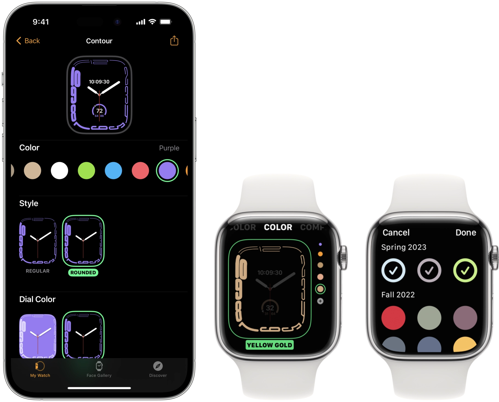

# WatchBandColors
### By Dylan McDonald

***WatchBandColors* is a convenient package that provides all of the Apple Watch Band colors that Apple uses for their Watch face options in watchOS. The colors are split into regular color options and Nike color options. A **demo project** is included for your convenience.**




**WatchBandColors** is, by default, implemented as an extension of UIColor so that you can make easy statements like `view.tintColor = .englishLavender`. If you want, you can easily change it to be a struct by following the instructions in `WatchBandColors.swift`. Just be sure to `import WatchBandColors`.
	**Example Usage:**
	`cell.backgroundColor = .abyssBlue`


There are many arrays provided for ease of use. There is an array for each season (such as `allSpring2022Colors`), and there are two arrays that hold every regular color (`allRegularColors`) and every Nike color (`allNikeColors`).


There are also two functions provided: `getColorString(forColor: UIColor)` and `isLightColor(forColor: UIColor)`. `getColorString` will provide the official Apple name for a given watch band color. `isLightColor` will return if Apple has deemed a given color as needing dark-colored text instead of light-colored text. 
	**Example usage:**
	
```swift
import WatchBandColors

cell.titleLabel.text = UIColor.getColorString(forColor: UIColor.allRegularColors[index])

if UIColor.isLightColor(forColor: UIColor.allRegularColors[index]) {
	cell.titleLabel.textColor = .black
} else {
	cell.titleLabel.textColor = .white
}
```


Every color and function has included autocomplete comments.

  
  
A demo project has been included so you can preview the package's functionality.


To use this package, you can install via Swift Packages, or just add the `WatchBandColors.swift` file to your project. However, using the Swift Package version will allow easy updates for when Apple adds new colors.


Please be sure to include proper credit in your project if you use this. This package is available under the MIT License.


If you notice any issues or missing colors, please [contact me](mailto:dylan@dylanmcd.com)!
